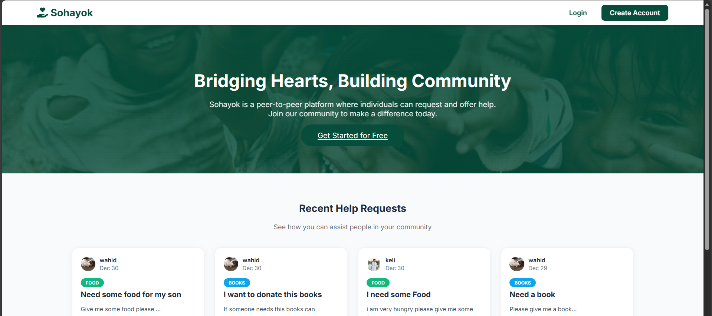

# 🤝 Sohayok — A Decentralized Emergency Help Network

**Sohayok** is a peer-to-peer assistance platform designed to concatenate demand and supply during critical moments. It serves as a digital bridge between donors, recipients, and volunteers to ensure that help reaches the needy at the right time.

---

## 💡 Inspiration
The inspiration for **Sohayok** came from observing the chaotic nature of emergency requests on social media. Helping the needy at the right time brings a huge impact on society, yet urgent pleas often get lost among irrelevant content. We built this sanctuary to ensure that the primary reason for suffering is not a lack of resources, but a lack of connection.

---

## 🤝 What It Does
Sohayok is a multi-service platform where users can register as either a **Donor** or a **Recipient**, with the flexibility to switch roles as needed. 

* **Six Exclusive Services:** Users can choose from Food, Education, Cloth, Blood, Organ Sharing, and Financial Aid (Sohayok Pay).
* **Volunteer Integration:** A unique feature allowing passionate individuals to assist in delivering needs directly to a recipient's doorstep.
* **Leaderboard:** A dedicated leaderboard to recognize and rank volunteers based on their service performance.

---

## 🛠️ How We Built It
Built using a **modern LAMP stack**, our application focuses on dynamic routing and asynchronous coordination to manage the flow of services.

* **Backend & Logic:** PHP manages the "Feed the Need" logic, ensuring users are routed to the correct service workbaskets.
* **Database:** MySQL relational schema handles complex interactions between users, service requests, and volunteer assignments.
* **Frontend:** Mobile-first CSS with attractive icons for each service type to initiate the workflow instantly.
* **Real-Time Coordination:** AJAX (jQuery) enables live request tracking and instant communication between donors and recipients.

---

## ✨ Key Features & Innovation

### 1. Verification & Trust
To ensure that submitted details do not contain false information, Sohayok includes a dedicated **Background Verification Process**. Requests for sensitive services like Financial Aid or Education only move forward once the admin verifies the attached documents.

### 2. Sohayok Pay & Financial Aid
Recipients can raise money requests for themselves or others (friends/relatives) for predefined reasons such as illness, accidents, or natural calamities. It includes modal dialogs to thank donors and facilitates negotiated payment methods.

### 3. Comprehensive Service Flow
Whether it is Food, Cloth, or Blood, the system handles the case from initial request to volunteer pickup and final fulfillment feedback.

### 4. Progress Tracking
We implemented a **Completion Status Progress Bar** during registration and service requests to allow customers to track their status in real-time.

---

## 🚧 Challenges We Conquered
* **Live Request Management:** Making and managing live requests between donors and recipients was a significant hurdle.
* **Service Prioritization:** Choosing and handling the most needful services among six different categories required complex logic.
* **Volunteer Routing:** Coordinating the delivery of requirements from donor to recipient at the right time using volunteer assistance.
* **Verification Logic:** Ensuring that the case does not move forward unless background verification and terms and conditions are successfully met.

---

## 📚 Learning Experience
This project was a memorable learning journey where we mastered:
* **Dynamic Routing:** Routing cases to specific workbaskets based on role and service type.
* **Customizing Portals:** Creating unique user interfaces for different roles (Donor vs. Recipient).
* **Complex Case Management:** Handling the end-to-end lifecycle of varied services from Organ Sharing to Financial Aid.

---

## 🚀 What's Next for Sohayok
* **Automated Document Verification:** Using AI to speed up the background verification process.
* **Expanded Volunteer Network:** Enhancing the dynamic routing for volunteers based on proximity.
* **Global Support:** Scaling the infrastructure to support mutual aid across different regions and languages.

---

> **"Anybody can help, but help at the right time makes the big difference."**
